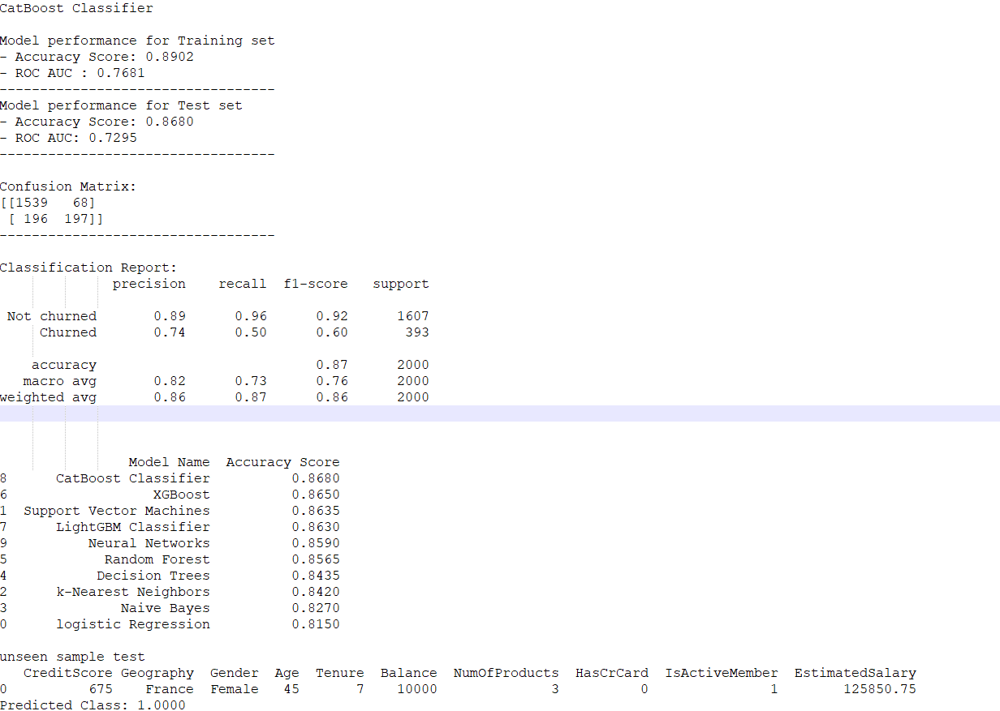

This project uses various ML classification models to predict the customer churn at a bank.
The dataset used was taken from: https://www.kaggle.com/datasets/shrutimechlearn/churn-modelling .
The dataset contains 10000 records and 14 columns.
Exploratory data analysis was conducted using Pandas in Jupyter notebook. (Included in package)
The following classification models was used in this project and the best model (CatBoost Classifier) was selected and results presented.

-logistic Regression
-Support Vector Machines
-k-Nearest Neighbors
-Naive Bayes
-Decision Trees
-Random Forest
-XGBoost
-LightGBM Classifier
-CatBoost Classifier
-Neural Networks

The CatBoost Classifier classifier has an accuracy of 87% on the testing data.

from the confusion matrix below we can see that the model correct predicted 1539 of the churns and 197 of the non-churn
from the test dataset of 2000 records

The output:

